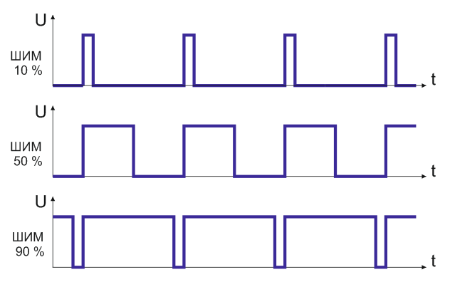
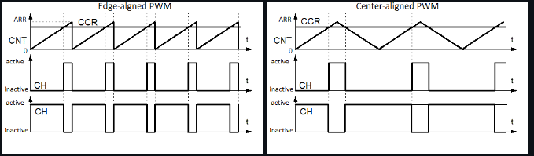

# Анализ работы режимов ШИМ и Захвата на базе таймеров TIM1 и TIM2
 * NUCLEO-F401RE
 * STM32F401RET6U
 * ARM Cortex M4
 * CMSIS
 * STM32 CubeIDE v1.13.2

>Программа реализует генерацию ШИМ сигнала с таймера TIM1 и захватом этого сигнала по восходящему фронту таймером TIM2. Снимая значениям захвата таймера в первый и второй момент прихода импульса и зная частоту таймера TIM2, высчитывается частота генерируемого сигнала TIM1.

---
<details>
  <summary>Параметры ШИМ</summary>
  ШИМ представляет из себя прямоугольный сигнал. Кроме очевидных максимального и минимального значения напряжения, имеются два важных параметра, описывающих форму сигнала: коэффициент заполнения и частота. На картинке приведен пример с различными к.зап.: 10%, 50%, 90%. Существует ещё скважность - величина обратная коэффициенту заполнения. Для справки, в отношении скважности и к.зап. в англоязычной литературе используется только термин Duty cycle.
  
  
</details>   

---
---
<details>
  <summary>Генерация ШИМ</summary>
  На картинках изображена зависимость значения таймера CNT от времени, а также изображён порог, лежащий в регистре CCR. ШИМ получается простым вычислением (CNT >= CCR). Если таймер все время растёт и переполняется, то такая ШИМ называется edge-aligned PWM. Если таймер считает вверх/вниз, то получается center-aligned PWM. Заметьте, что скважность зависит от порога. Если менять порог, то у edge-aligned ШИМ один из фронтов будет неподвижен, в то время когда у center-aligned импульсов не смещается центр. Глядя на картинку, вы должны обнаружить, что частота зануления таймера совпадает с частотой ШИМ.
  
  
</details>   

---


Инициализация всех параметров происходила в среде CubeMX
* Ключевые настройки таймера  TIM1:
1. Настройка тактирования
1. Настроили таймер TIM1 в режим PWM Generation CH1
2. Настроили предделитель 
3. Загрузили значение в регистр перезагрузки 

```C
//...
 sClockSourceConfig.ClockSource = TIM_CLOCKSOURCE_INTERNAL;

if (HAL_TIM_PWM_ConfigChannel(&htim1, &sConfigOC, TIM_CHANNEL_1) != HAL_OK)
  {
    Error_Handler();
  }

htim1.Init.Prescaler = 16-1;
htim1.Init.Period = 100-1;
//...
```
* Ключевые настройки таймера  TIM2:
1. Настройка тактирования
1. На канале CH1 настроили таймер на работу Input Capture Direct Mode 
3. Настроили предделитель 
4. Загрузили значение в регистр перезагрузки в данном случае max 
> 

```C
//...
 sClockSourceConfig.ClockSource = TIM_CLOCKSOURCE_INTERNAL;

 if (HAL_TIM_IC_ConfigChannel(&htim2, &sConfigIC, TIM_CHANNEL_1) != HAL_OK)
  {
    Error_Handler();
  }

 htim2.Init.Prescaler = 16-1;
 htim2.Init.Period = 4294967295;
//...
```
## Обработчик прервания по захвату 
С помощью таймера TIM1 мы смоделировали частоту сигнала 10KHz

```C
void HAL_TIM_IC_CaptureCallback(TIM_HandleTypeDef *htim)

{
	if (htim->Channel == HAL_TIM_ACTIVE_CHANNEL_1)
	{
		if (Is_First_Captured==0) 
		{
			IC_Val1 = HAL_TIM_ReadCapturedValue(htim, TIM_CHANNEL_1); 
			Is_First_Captured = 1;  
		}

		else  
		{
			IC_Val2 = HAL_TIM_ReadCapturedValue(htim, TIM_CHANNEL_1);  
			if (IC_Val2 > IC_Val1)
			{
				Difference = IC_Val2-IC_Val1;
			}

			else if (IC_Val1 > IC_Val2)
			{
				Difference = (0xffffffff - IC_Val1) + IC_Val2;
			}

			float refClock = TIMCLOCK/(PRESCALAR);

			frequency = refClock/Difference;

			__HAL_TIM_SET_COUNTER(htim, 0);  
			Is_First_Captured = 0; 
		}
	}
}
```


