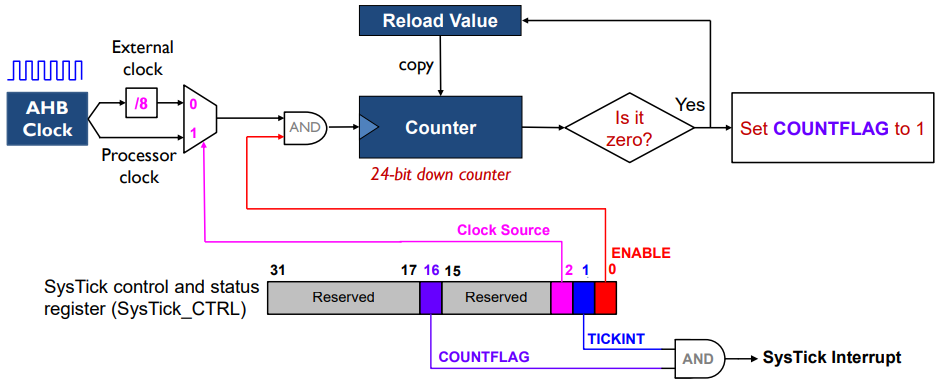
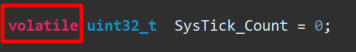

# Обзор Системного Таймера (SysTick)
 * NUCLEO-F401RE
 * STM32F401RET6U
 * ARM Cortex M4
 * CMSIS
 * STM32 CubeIDE v1.13.2

>Программа реализует мерцание светодиода LD2 , подключенным анодом к ножке микроконтроллера PA5 ,  с периодом 2 секунды с использованием задержки по прерыванию от 24-битного системного таймера.

---
<details>
  <summary>Принцип работы системного таймера</summary>
  
  
</details>   

---
Для инициализации системного таймера использована функция `SysTick_Config()` Ключевым является настройка *предделителя*,  *источника тактирования*, *разрешение прерываний*, и *включение таймера*.
```C
SysTick->LOAD  = (uint32_t)(ticks - 1UL);  
SysTick->CTRL  =   SysTick_CTRL_CLKSOURCE_Msk |
                   SysTick_CTRL_TICKINT_Msk   |
                   SysTick_CTRL_ENABLE_Msk;   
```

 Системный таймер является частью ядра, поэтому во внутренний контроллер прерываний NVIC включать его не нужно , включение производится непосредственно в регистре `SysTick->CTRL` 

#### Добавлен обработчик для таймера
```C
void  SysTick_Handler(void)
     {
        if (SysTick_Count > 0) SysTick_Count --;
     }
```
Обработчик вызывается каждую миллисекунду. Чтобы помигать светодиодом с определенной частотой, добавлена функция задержки ```delay_ms()```, в которой переменная-счетчик проверяется пока обработчик прервания не занулит её и мы выйдем из цикла задержки. 
Если мы хотим задержку 1 секунду , то мы в параметр ms кладем 1000, прерывание вызывается 1000 раз каждую миллисекунду .

```C
void delay_ms(int ms)
    	{
    		SysTick_Count = ms;
    		while (SysTick_Count){}
    	}
```
---
<details>
  <summary>Проблемы при оптимизации</summary>
  При оптимизации компилятор предпологает,
что значение SysTick_Count не изменяется
между двумя его применениями и в
SysTick_Handler переменная уже не
отражает свое актуальное состояние


**Решение**

  ```C
  volatile uint32_t SysTick_Count = 0;
__attribute__((optimize(0))) void delay_ms(int ms)
  ```
  
  </details>

---


